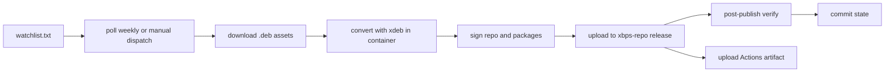

# debport

[](https://github.com/bagaskara815/debport/actions/workflows/convert.yml)
[](https://github.com/bagaskara815/debport/releases/tag/xbps-repo)

A GitHub-Actions-only tool that converts upstream `.deb` packages to Void Linux
`.xbps` packages and publishes them as an installable xbps repository.

There is no local CLI. Everything runs in CI.

## How it works



Every week the workflow polls the watchlist. When a source publishes something
new, the matching `.deb` assets are downloaded, converted to `.xbps` with
[xdeb](https://github.com/xdeb-org/xdeb) inside the
`ghcr.io/void-linux/void-buildroot-glibc` container, RSA-signed, and uploaded
to the `xbps-repo` release of **this** repository. That release doubles as a
remote xbps repository, so converted apps install like any Void package.
Converted packages are also attached to the run as an Actions artifact.

## Quick start

Register this repo once, then install and update as usual:

```sh
echo "repository=https://github.com/bagaskara815/debport/releases/download/xbps-repo" | sudo tee /etc/xbps.d/debport.conf
sudo xbps-install -Syu
sudo xbps-install -S helium-bin
```

> The first sync prompts to import the repository signing key. Answer **Y**.
> After that, `sudo xbps-install -Syu` keeps converted apps updated together
> with the rest of the system.

Packages are downloaded over the `releases/download` URL, RSA-signed, and
their shlib dependencies resolve against the official Void `current` repo,
so nothing extra is needed on the client side.

## Adding a source

Add one line to [`watchlist.txt`](watchlist.txt):

```
<source>|<asset glob>|<extra xdeb flags>
```

| Source form | Example | Update detection |
| --- | --- | --- |
| GitHub releases (`owner/repo`) | `imputnet/helium-linux\|*_amd64.deb\|` | latest release tag |
| HTTP directory pool (ends in `/`) | `https://rpm.librewolf.net/pool/\|librewolf-*x86_64-deb.deb\|` | newest matching filename (version sort) |
| Direct `.deb` link | `https://example.com/dist/foo_1.2_amd64.deb\|*\|` | the URL itself (re-runs when the URL changes) |

Rules:

- **Glob is required** and must select x86_64/amd64 debs only. The runner is
  x86_64; `xbps-rindex` silently drops other architectures.
- Extra flags are whitespace-separated xdeb options appended to `-Sedf`
  (no spaces inside a flag value), e.g. `--not-deps=musl`.
- `.deb` filenames may follow any convention: package names are read from the
  deb control data, not the filename.

## Running

| Trigger | How |
| --- | --- |
| Scheduled | `23 3 * * 1` (Monday 03:23 UTC). Upstream repos cannot webhook here, so polling is the only trigger. |
| Manual | Actions → *Convert deb to xbps* → Run workflow. Leave `repo` empty to convert all entries (or scope to one); `force: true` reconverts even when the tag is already recorded in `state/`. |

Runs write `state/<source>.txt` with the converted revision and commit it back
to the repo, so unchanged entries are cheaply skipped on the next run.

## Repository layout

```
.github/workflows/convert.yml   # weekly poll + manual trigger, artifact upload
scripts/convert.sh              # runs INSIDE the container: installs missing tools,
                                # converts each .deb with xdeb, asserts output + repodata,
                                # records a manifest, signs repo + packages with XBPS_PRIVKEY
scripts/run.sh                  # runner-side orchestrator: poll, download, seed repodata,
                                # convert in container, publish, verify, record state
watchlist.txt                   # sources to poll
state/                          # last converted revision per source (committed by CI)
```

## Requirements

- The repository must be **public** (anonymous fetch of the release assets).
- Actions secret `XBPS_PRIVKEY`: an RSA private key (PEM) used to sign the
  repository metadata and packages. Without it the workflow fails fast:
  remote xbps installs require signed `.xbps.sig2` files.

## Design notes

- Results are published as **release assets**, not git blobs: `.xbps` files
  exceed GitHub's 100 MB per-file limit while release assets allow 2 GB.
- Old package versions are never pruned from the release; the repodata index
  always points at the newest version (stale assets are unreferenced).
- Post-publish verification checks that every served filename matches the
  `pkgver.arch.xbps` convention, and resolves each package against the real
  release URL plus the official Void repo before recording state.
